.. _user_guide:

Scopy
================================================================================

About 
---------------------------------------------------------------------
Scopy is a multi-functional software toolset with strong capabilities for signal analysis.

Download
---------------------------------------------------------------------

.. tip::  

      **Scopy for Windows**
        * Download: `Installer for latest release (Windows 64/32-bit) <https://github.com/analogdevicesinc/scopy/releases/latest>`_ 

      **Scopy for Linux**
        * Download: `Scopy Flatpak installer <https://github.com/analogdevicesinc/scopy/releases/latest>`_  

      **Scopy for OSX**
        * Download:`OSX installer <https://github.com/analogdevicesinc/scopy/releases/latest>`_ 

      **Scopy for Android**
        * Download: `Android installer <https://github.com/analogdevicesinc/scopy/releases/latest>`_ 
        * Google Play store link: `Scopy <https://play.google.com/store/apps/details?id=org.adi.scopy>`_ 

      **Scopy all platforms latest(nightly) builds**
        * Download:`Installer for latest (nightly) build <https://github.com/analogdevicesinc/scopy/releases/tag/continous>`_ 

.. warning::

  In order to have Scopy working with `ADALM2000 <https://www.analog.com/en/resources/evaluation-hardware-and-software/evaluation-boards-kits/ADALM2000.html>`__  please make sure that the Device Drivers are installed. A guide on this topic can be found in the section:
    * `ADALM2000 for End Users <https://wiki.analog.com/university/tools/m2k/users>`__ 

Installation
---------------------------------------------------------------------

  **Scopy for Windows**

Once you downloaded the installer, run it and follow all the required steps. After completion, system reboot is required.

Video intalation guide:

.. video:: https://www.youtube.com/watch?v=894HkVXf7-U

  **Scopy for Linux**

Before downloading and extracting the scopy-v1.1.1-Linux-flatpak.zip archive, you need to setup Flatpak `using this setup guide <https://flatpak.org/setup/>`_ for your Linux distribution.

For Ubuntu, you can use the following steps:

.. code-block::

    sudo add-apt-repository ppa:alexlarsson/flatpak

    sudo apt update

    sudo apt install flatpak

    flatpak remote-add --if-not-exists flathub https://flathub.org/repo/flathub.flatpakrepo

After this, get the Scopy.flatpak file from the downloaded archive and run:

.. code-block::

    flatpak install scopy-v1.1.1-Linux-flatpak.flatpak

|

Video intalation guide:

.. video:: https://www.youtube.com/watch?v=9qgxmmTrcSE

|

  **Scopy for OSX**

Double click the downloaded .dmg to make its content available. “Scopy” will show up in the Finder sidebar and a window showing the content should open up.
Drag the application from the .dmg window into Applications to install and wait for the process to finish.

Video intalation guide:

.. video:: https://www.youtube.com/watch?v=To0ACQ77tkg

  **Scopy for Android**

Tap on the downloaded .apk file to start the installation process and proceed by hitting the “Install” button. Optionally, you may be warned that this application comes from unknown sources, hit the “Install anyway” button. Now, you can find “Scopy” together with your other apps.

In order to connect `ADALM2000 <https://www.analog.com/ADALM2000>`__  to your device, you will need an OTG adapter that will mediate the connection between your device and the USB cable, as shown in the image below.

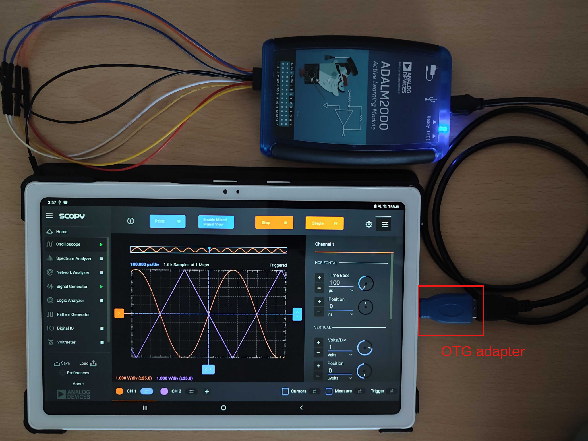
..

Launch
---------------------------------------------------------------------

Run Scopy from the Desktop Shortcut / Start Menu / Installation Folder.

On Linux, you can also run it using:

.. code-block::

    flatpak run org.adi.Scopy

Usage
---------------------------------------------------------------------

  **Home**

The Home view is divided into four sections:

* **Devices(1)**: List of devices (USB or remote) that Scopy can connect to. USB devices are detected automatically at startup. The Add button can be used to add remote devices to the list.
* **Instruments Menu(2)**: List with instruments provided by the application.
* **Information Window(3)**: Section containing the welcome, add device page and for each device a description.
* **General Settings Menu(4)**: Save and load session and the preferences menu.

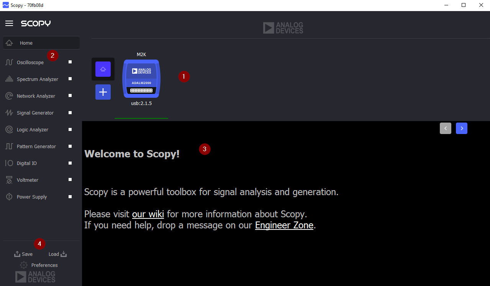
..

| 

  **Connecting to a USB device**
  

If a compatible USB device is available it will be displayed in the **Devices** section.

To connect to that device click on the device and then click the **Connect** button in the **Information Window.**

If the connection was established, the device will have a green status line under it and you will be able to disconnect from it in the same **Information Window.**

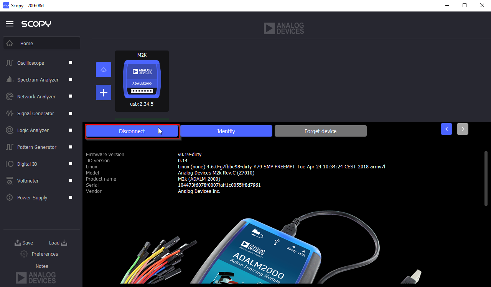
..

|

  **Connecting to a remote device**

To connect to a remote device click on the **Plus** icon. Enter the IP of the remote device into the **Hostname** field and click the **Connect** button. If a device can be detected at the IP you provided, the **Connect** button will change to an **Add** button and you can click on it to add the remote device to the list of detected devices.

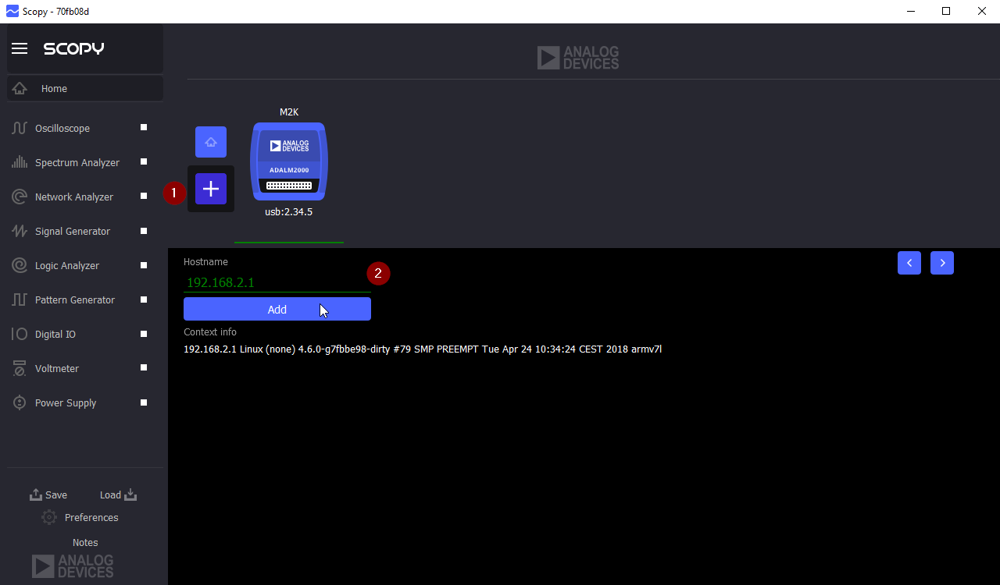
..

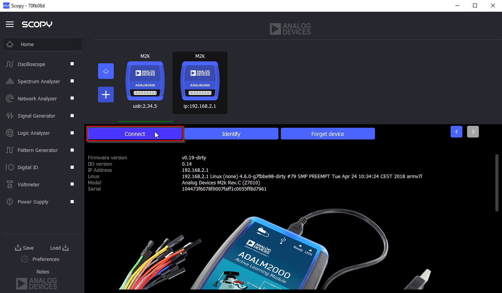
..

Clicking the Forget Device button will remove the device from the list. Clicking the Identify button will make the device blink.

|

  **General Settings Menu**

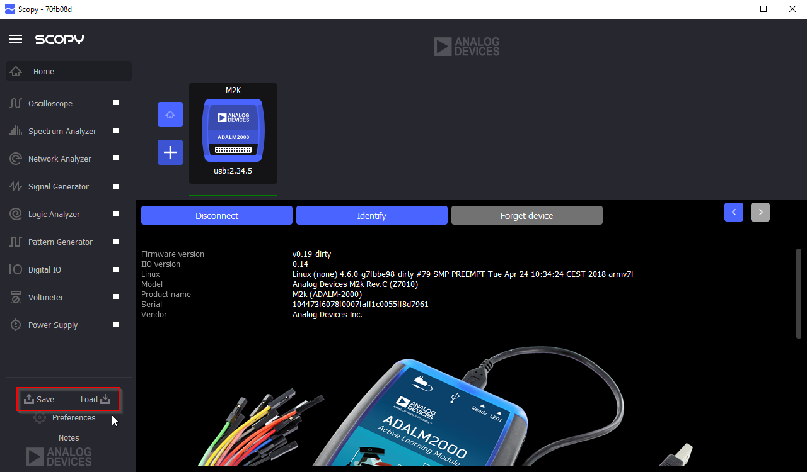
..

The save/load buttons can be used to save the current session or load another session. The preferences button will open the preferences for Scopy where different options for different tools can be modified.

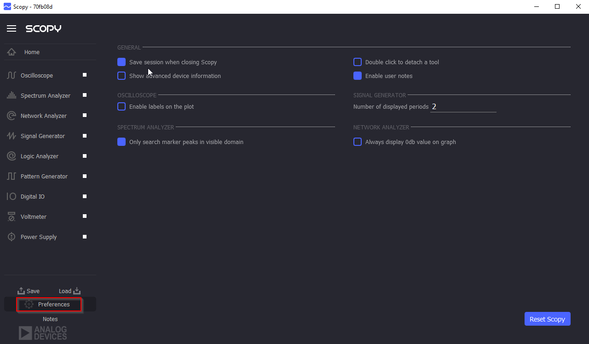
..

Clicking the **Reset Scopy** button will reset the application to a default configuration.

Checking the **user notes preference** will enable a tool where the user can add different pages with html formatted text

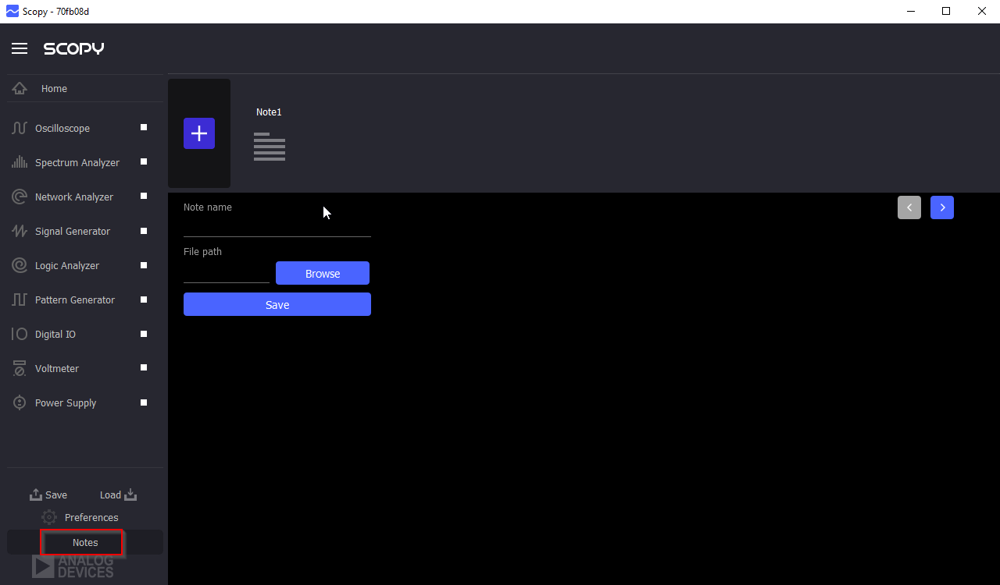
..

User Guides
---------------------------------------------------------------------

Scopy interacts with only one hardware device at a time. Once a device is selected to be used with the application, a list of instruments that are available for that device will be enabled. Each instrument can be opened from the left menu. The icon on the right of the instrument name specifies that the instrument is enabled and provides a shortcut that allows an instrument to be turned on or off.

The instruments menu can be minimized by clicking on the **Scopy** button near the top-left window.

|

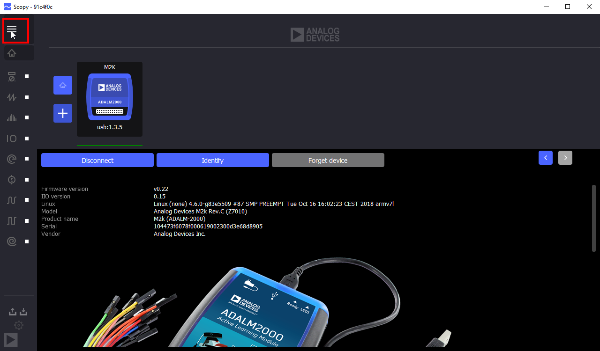
..

|

  **Detaching Instruments**

Scopy provides the detaching into multiple windows feature for each instrument available, providing a better view/manipulation.

There are 2 ways to do this:

* **Drag and Drop** - select the desired instrument drag it outside Instrument Menu section and drop it inside the application window area.

..

|

* **Double Click** - first make sure that the **Double click to detach** a tool option is enabled in the **Preferences** menu; double-click on the desired instrument to detach it.

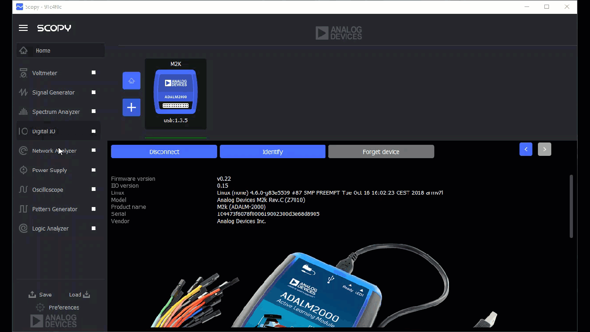
..

|

Instruments Overview
---------------------------------------------------------------------

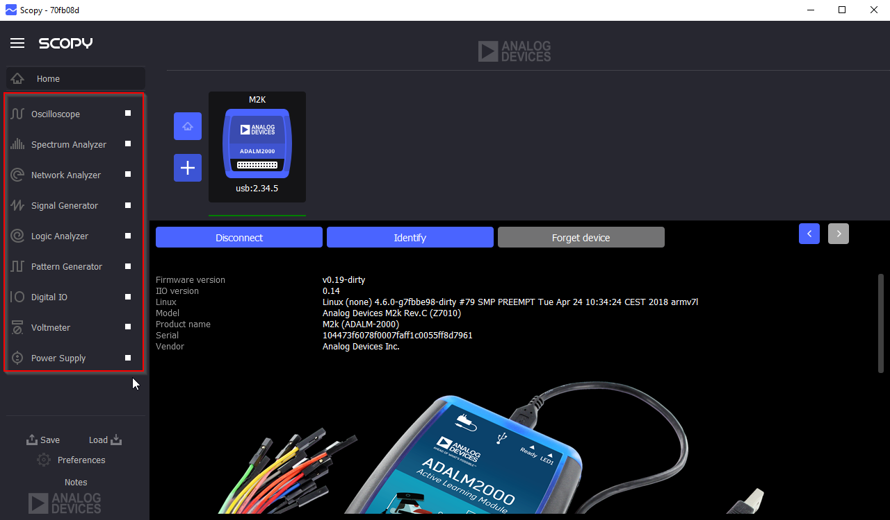
..

|

Scopy is using a list of plugins detailed :ref:`here <plugins>`.

Complete user guides on how to use each Scopy instrument:

* ADALM2000 plugins :

    * :ref:`Oscilloscope <oscilloscope>`
    * :ref:`Spectrum Analyzer <spectrum_analyzer>`
    * :ref:`Network Analyzer <network_analyzer>`
    * :ref:`Signal Generator <signal_generator>`
    * :ref:`Logic Analyzer <logic_analyzer>`
    * :ref:`Pattern Generator <pattern_generator>`
    * :ref:`Digital IO <digitalio>`
    * :ref:`Voltmeter <voltmeter>`
    * :ref:`Power Supply <power_supply>`

Scripting
---------------------------------------------------------------------

User guide on how to use scripts with Scopy:

* `Scopy Scripting Guide <https://wiki.analog.com/university/tools/m2k/scopy/scripting-guide>`_  

Building from source
---------------------------------------------------------------------

Complete Scopy build guides on:

* `Windows <https://wiki.analog.com/university/tools/m2k/scopy/build-windows>`_ 
* `Linux <https://wiki.analog.com/university/tools/m2k/scopy/build-linux>`_ 
* `OSX <https://wiki.analog.com/university/tools/m2k/scopy/build-osx>`_ 

Source code
---------------------------------------------------------------------

The source code for the entire application can be found on `github <https://github.com/analogdevicesinc/scopy>`_ 

