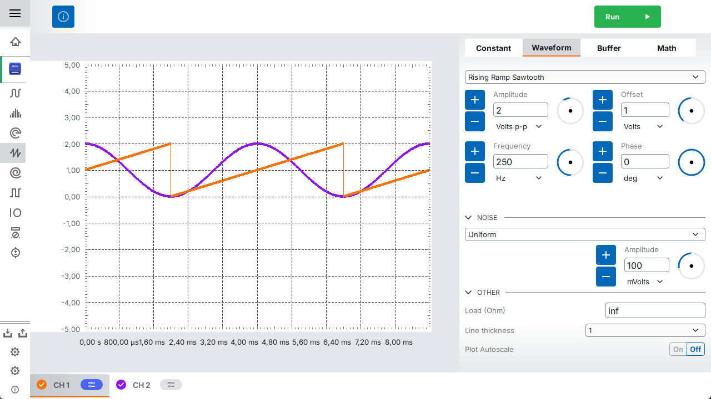
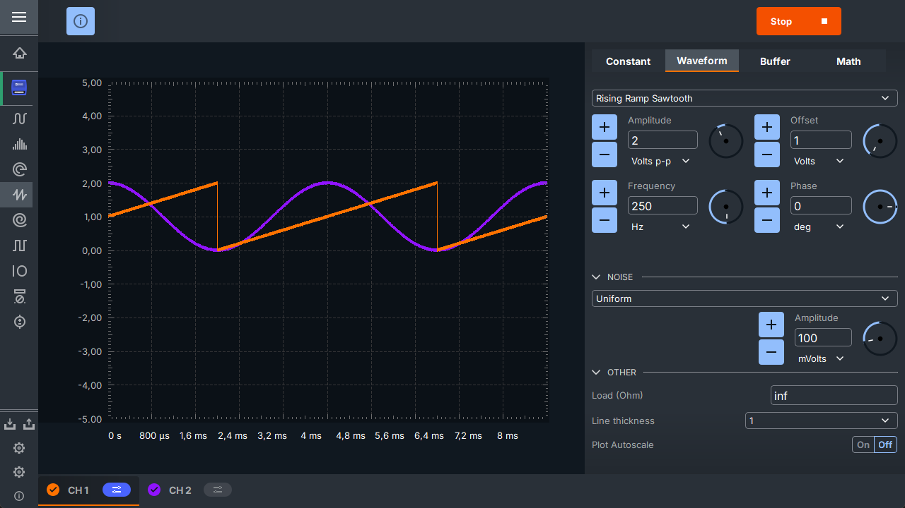

Scopy
===============================================================================

`Analog Devices Inc. <https://www.analog.com>`__
Scopy is a multi-functional software toolset with strong capabilities for
signal analysis.

.. note::

   We are in the process of moving the Scopy documentation from
   `wiki <https://wiki.analog.com/university/tools/m2k/scopy#user_guides>`__
   to :git-scopy:`/`.

   We apologize for any inconvenience that may occur due to this migration.

.. hdl-build-status::

Contents
-------------------------------------------------------------------------------

.. toctree::
   :includehidden:
   :maxdepth: 6

   user_guide/index
   plugins/index
   developer_guide/index
   tests/index
   architecture/index

   user_guide/preferences
   user_guide/bugReport
   user_guide/troubleshooting
   
